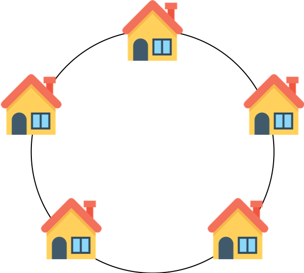

# 도둑질

### 문제 설명

도둑이 어느 마을을 털 계획을 하고 있습니다. 이 마을의 모든 집들은 아래 그림과 같이 동그랗게 배치되어 있습니다.

각 집들은 서로 인접한 집들과 방범장치가 연결되어 있기 때문에 인접한 두 집을 털면 경보가 울립니다.

각 집에 있는 돈이 담긴 배열 money가 주어질 때, 도둑이 훔칠 수 있는 돈의 최댓값을 return 하도록 solution 함수를 작성하세요.

-----------
### 제한 사항

- 이 마을에 있는 집은 3개 이상 1,000,000개 이하입니다.
- money 배열의 각 원소는 0 이상 1,000 이하인 정수입니다.

-----------
### 입출력 예

| money        | result |
|--------------|--------|
| [1, 2, 3, 1] | 4      |

-----------
### URL

https://programmers.co.kr/learn/courses/30/lessons/42897

-----------
## 풀이
1. 첫 번째값을 선택했을 때와 선택하지 않았을 때로 나눠서 각각 최댓값을 구한 뒤 큰 값을 리턴한다.
2. 점화식은 `dp[n]` = `max(dp[n-3], dp[n-2])` + `arr[n]`이다.
3. `dp[0] = money[0]`, `dp[1] = money[1]`, `dp[2] = dp[0] + money[2]`이다.
4. `money.length`가 3이면 3번 조건이 성립하지 않으므로 세개 비교해서 큰 값 리턴한다.
5. 첫 번째 값을 고른다고 가정하고 `money`를 이용하여 `dp`배열을 만들고 계산하여 최대값을 구한다.
   1. 첫 번째 값을 고르면 마지막 값을 고를 수 없으므로 마지막 `dp`는 계산하지 않는다.
6. 첫 번째 값을 고르지 않는다고 가정하여 `dp[0]`을 0으로 놓고 계산하여 최대값을 구한다.
7. 3, 4번에서 구한 값 중 큰 값을 리턴한다.