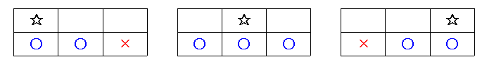

# 내려가기

### 문제 설명

N줄에 0 이상 9 이하의 숫자가 세 개씩 적혀 있다. 내려가기 게임을 하고 있는데, 이 게임은 첫 줄에서 시작해서 마지막 줄에서 끝나게 되는 놀이이다.

먼저 처음에 적혀 있는 세 개의 숫자 중에서 하나를 골라서 시작하게 된다. 그리고 다음 줄로 내려가는데, 다음 줄로 내려갈 때에는 다음과 같은 제약 조건이 있다. 바로 아래의 수로 넘어가거나, 아니면 바로 아래의 수와 붙어 있는 수로만 이동할 수 있다는 것이다. 이 제약 조건을 그림으로 나타내어 보면 다음과 같다.

별표는 현재 위치이고, 그 아랫 줄의 파란 동그라미는 원룡이가 다음 줄로 내려갈 수 있는 위치이며, 빨간 가위표는 원룡이가 내려갈 수 없는 위치가 된다. 숫자표가 주어져 있을 때, 얻을 수 있는 최대 점수, 최소 점수를 구하는 프로그램을 작성하시오. 점수는 원룡이가 위치한 곳의 수의 합이다.

-----------
### 입력

첫째 줄에 N(1 ≤ N ≤ 100,000)이 주어진다. 다음 N개의 줄에는 숫자가 세 개씩 주어진다. 숫자는 0, 1, 2, 3, 4, 5, 6, 7, 8, 9 중의 하나가 된다.

-----------
### 출력

첫째 줄에 얻을 수 있는 최대 점수와 최소 점수를 띄어서 출력한다.

-----------
### URL

https://www.acmicpc.net/problem/2096

-----------
## 풀이
1. 다음과 같은 점화식을 세울 수 있으므로 DP로 해결한다. `f(n, k) = MAX(f(n-1, k-1), f(n-1, k), f(n-1, k+1)) + v` (n은 행, k는 열, v는 해당 칸의 값)
2. 위의 점화식에서 MAX만 MIN으로 바꿔준다면 최소 역시 구할 수 있으므로 N개의 행과 3개의 열을 가지는 배열 maxDp와 minDp를 생성하여 누적합을 기록한다. (0번 행은 최대, 1번 행은 최소)
3. maxDp와 minDp의 마지막 행 최대값과 최소값을 출력한다.

- dp계산 진행시 n-2부터는 사용하지 않아 굳이 저장할 필요가 없으므로 2개의 행과 3개의 열을 가지는 dp배열로 통일할 수 있다.
- 입력을 받으면서 dp계산을 바로바로 처리하면 반복문을 두 번 돌지 않아도 된다.