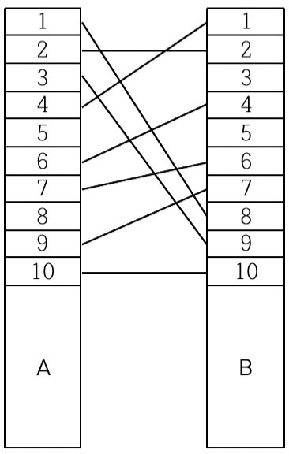

# 전깃줄

### 문제 설명

두 전봇대 A와 B 사이에 하나 둘씩 전깃줄을 추가하다 보니 전깃줄이 서로 교차하는 경우가 발생하였다. 합선의 위험이 있어 이들 중 몇 개의 전깃줄을 없애 전깃줄이 교차하지 않도록 만들려고 한다.

예를 들어, < 그림 1 >과 같이 전깃줄이 연결되어 있는 경우 A의 1번 위치와 B의 8번 위치를 잇는 전깃줄, A의 3번 위치와 B의 9번 위치를 잇는 전깃줄, A의 4번 위치와 B의 1번 위치를 잇는 전깃줄을 없애면 남아있는 모든 전깃줄이 서로 교차하지 않게 된다.

전깃줄이 전봇대에 연결되는 위치는 전봇대 위에서부터 차례대로 번호가 매겨진다. 전깃줄의 개수와 전깃줄들이 두 전봇대에 연결되는 위치의 번호가 주어질 때, 남아있는 모든 전깃줄이 서로 교차하지 않게 하기 위해 없애야 하는 전깃줄의 최소 개수를 구하는 프로그램을 작성하시오.

-----------
### 입력

첫째 줄에는 두 전봇대 사이의 전깃줄의 개수가 주어진다. 전깃줄의 개수는 100 이하의 자연수이다. 둘째 줄부터 한 줄에 하나씩 전깃줄이 A전봇대와 연결되는 위치의 번호와 B전봇대와 연결되는 위치의 번호가 차례로 주어진다. 위치의 번호는 500 이하의 자연수이고, 같은 위치에 두 개 이상의 전깃줄이 연결될 수 없다.

-----------
### 출력

첫째 줄에 남아있는 모든 전깃줄이 서로 교차하지 않게 하기 위해 없애야 하는 전깃줄의 최소 개수를 출력한다.

-----------
### URL

https://www.acmicpc.net/problem/2565

-----------
## 풀이
1. Longest Increasing Subsequence라는 알고리즘이다. DP를 이용할 수 있다.
2. LIS문제를 좀 더 풀어보고 감을 익혀야 할 것 같다.

- 출처: https://chanhuiseok.github.io/posts/algo-49/