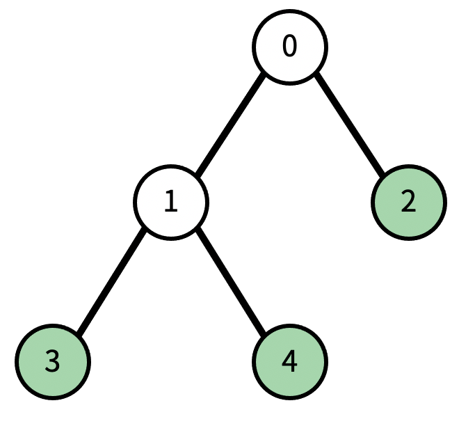

# 트리

### 문제 설명

트리에서 리프 노드란, 자식의 개수가 0인 노드를 말한다.

트리가 주어졌을 때, 노드 하나를 지울 것이다. 그 때, 남은 트리에서 리프 노드의 개수를 구하는 프로그램을 작성하시오. 노드를 지우면 그 노드와 노드의 모든 자손이 트리에서 제거된다.

예를 들어, 다음과 같은 트리가 있다고 하자.

현재 리프 노드의 개수는 3개이다. (초록색 색칠된 노드) 이때, 1번을 지우면, 다음과 같이 변한다. 검정색으로 색칠된 노드가 트리에서 제거된 노드이다.

이제 리프 노드의 개수는 1개이다.

-----------
### 입력

첫째 줄에 트리의 노드의 개수 N이 주어진다. N은 50보다 작거나 같은 자연수이다. 둘째 줄에는 0번 노드부터 N-1번 노드까지, 각 노드의 부모가 주어진다. 만약 부모가 없다면 (루트) -1이 주어진다. 셋째 줄에는 지울 노드의 번호가 주어진다.

-----------
### 출력

첫째 줄에 입력으로 주어진 트리에서 입력으로 주어진 노드를 지웠을 때, 리프 노드의 개수를 출력한다.

-----------
### URL

https://www.acmicpc.net/problem/1068

-----------
## 풀이
1. 노드를 삭제하는 로직 -> 리프 노드를 세는 로직 두 로직이 필요하다.
2. 각 노드의 부모 노드를 기억하는 배열을 만들고 두 로직 모두 dfs로 구현한다.
3. 삭제하려는 노드가 루트 노드일 때는 리프 노드를 세는 로직이 제대로 작동하지 않으므로 따로 0을 출력한다.