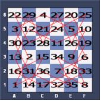

# 나이트 투어

### 문제 설명

나이트 투어는 체스판에서 나이트가 모든 칸을 정확히 한 번씩 방문하며, 마지막으로 방문하는 칸에서 시작점으로 돌아올 수 있는 경로이다. 다음 그림은 나이트 투어의 한 예이다.

영식이는 6×6 체스판 위에서 또 다른 나이트 투어의 경로를 찾으려고 한다. 체스판의 한 칸은 A, B, C, D, E, F 중에서 하나와 1, 2, 3, 4, 5, 6 중에서 하나를 이어 붙인 것으로 나타낼 수 있다. 영식이의 나이트 투어 경로가 주어질 때, 이것이 올바른 것이면 Valid, 올바르지 않으면 Invalid를 출력하는 프로그램을 작성하시오.

-----------
### 입력

36개의 줄에 나이트가 방문한 순서대로 입력이 주어진다. 체스판에 존재하는 칸만 입력으로 주어진다.

-----------
### 출력

첫째 줄에 문제의 정답을 출력한다.

-----------
### URL

https://www.acmicpc.net/problem/1331

-----------
## 풀이
1. 중복을 체크하기 위한 Set<String> `visited`를 정의한다.
2. 각 입력마다 앞 글자를 `col`, 뒷 글자를 `row`로 받는다.
3. 현재 입력을 이미 방문했거나 `col`과 `row` 중 한쪽 방향으로 3칸을 이동했거나 이전 `col`과 현재 `col`의 차이와 이전 `row`와 현재 `row`의 차이의 합이 3이 아니면 `Invalid`를 출력하고 리턴한다.
4. 모든 반복이 끝난뒤 시작 위치로 돌아갈 수 있으면 `Valid`를 출력한다.