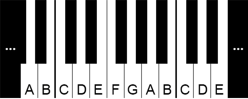

# 반음

### 문제 설명

서양 음악의 음계는 도레미파솔라시의 칠음계이다. 각각의 음은 차례로 영어 알파벳 CDEFGAB에 대응된다(도다레라미마파바솔사라가시나도다를 생각하면 됨). 이 문제에서는 이러한 일곱 음만을 다루기로 한다.

하지만 모든 음이 이 일곱으로만 구성된 것은 아니다. 피아노에는 위의 그림과 같이 검은 건반이 있으며, 검은 건반은 인접한 흰 건반과 반음의 차이가 난다. 즉, C와 D사이에 있는 검은 건반은 C, D와 반음 차이가 난다. 검은 건반이 사이에 없는 경우에는, 붙어 있는 두 흰 건반이 반음 차이가 난다. 예를 들어 B, C는 반음 차이가 나며, E, F는 반음 차이가 난다.

이러한 반음 차이를 이용하여, 두 음 사이의 거리를 정의할 수 있다. F로부터 -1만큼 떨어진(왼쪽으로 반음) 음은 E이고, F로부터 4만큼 떨어진(오른쪽으로 반음 네 번) 음은 A이다. 이 문제에서는 칠음(흰 건반)만을 따지므로, F로부터 1만큼 떨어진 음은 없다.

이러한 거리들을 모으면 하나의 악보가 된다. 예를 들어 2 2 1 2 2 2 1과 같은 악보는, 차례로 CDEFGABC를 누르는 악보이다. 즉, 이 악보는 첫 음이 C이고 끝 음이 C인 악보가 된다. 하지만 이 악보는 첫 음이 D일 수는 없는데, 그 경우 DE 다음에 검은 건반이 눌리게 되기 때문이다. 악보가 주어졌을 때, 가능한 첫 음과 끝 음의 쌍을 모두 구해내는 프로그램을 작성하시오. 피아노는 좌우로 무한히 길다고 가정한다.

-----------
### 입력

첫째 줄에 악보의 길이를 나타내는 정수 n(1 ≤ n ≤ 10,000)이 주어진다. 다음 n개의 줄에는 절댓값이 20을 넘지 않는 정수로 악보가 주어진다.

-----------
### 출력

첫째 줄부터 차례로 첫 음과 끝 음을 출력한다. 여러 경우가 가능할 때에는 알파벳이 작은 경우부터 출력한다.

-----------
### URL

https://www.acmicpc.net/problem/2034

-----------
## 풀이
1. n와 악보를 입력받는다.
2. 정답을 저장할 ArrayList<String>을 생성한다.
2. 흰 건반과 검은 건반을 포함하여 12개를 표시하는 boolean배열 available를 생성한다.
2. 흰 건반은 true, 검은 건반을 false로 초기화한다.
3. 흰 건반의 인덱스를 순회하며 다음을 수행한다.
   1. 현재 위치를 순회중인 인덱스로 지정한다.
   2. 가능한 음으로 판단 되었을때, 출력하기 위한 StringBuilder를 생성한다.
   2. 악보를 순회하며 다음을 수행한다.
      1. 현재 위치를 악보에 따라 조정할 수 있는지 available을 이용해 확인하고, 조정할 수 없다면 탈출한다.
      2. 조정할때, 배열의 범위를 벗어나면 알맞게 값을 조정한다.
      3. 첫 음과 마지막 음은 기록한다.
   3. 마지막 음이 기록되었으면 형식에 맞게 저장한다.