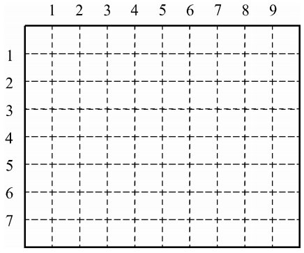

# 종이자르기

### 문제 설명

아래 <그림 1>과 같이 직사각형 모양의 종이가 있다. 이 종이는 가로방향과 세로 방향으로 1㎝마다 점선이 그어져 있다. 가로 점선은 위에서 아래로 1번부터 차례로 번호가 붙어 있고, 세로 점선은 왼쪽에서 오른쪽으로 번호가 붙어 있다.

점선을 따라 이 종이를 칼로 자르려고 한다. 가로 점선을 따라 자르는 경우는 종이의 왼쪽 끝에서 오른쪽 끝까지, 세로 점선인 경우는 위쪽 끝에서 아래쪽 끝까지 한 번에 자른다. 예를 들어, <그림 1>의 가로 길이 10㎝이고 세로 길이 8㎝인 종이를 3번 가로 점선, 4번 세로 점선, 그리고 2번 가로 점선을 따라 자르면 <그림 2>와 같이 여러 개의 종이 조각으로 나뉘게 된다. 이때 가장 큰 종이 조각의 넓이는 30㎠이다.

입력으로 종이의 가로 세로 길이, 그리고 잘라야할 점선들이 주어질 때, 가장 큰 종이 조각의 넓이가 몇 ㎠인지를 구하는 프로그램을 작성하시오.

-----------
### 입력

첫줄에는 종이의 가로와 세로의 길이가 차례로 자연수로 주어진다. 가로와 세로의 길이는 최대 100㎝이다. 둘째 줄에는 칼로 잘라야하는 점선의 개수가 주어진다. 셋째 줄부터 마지막 줄까지 한 줄에 점선이 하나씩 아래와 같은 방법으로 입력된다. 가로로 자르는 점선은 0과 점선 번호가 차례로 주어지고, 세로로 자르는 점선은 1과 점선 번호가 주어진다. 입력되는 두 숫자 사이에는 빈 칸이 하나씩 있다.

-----------
### 출력

첫째 줄에 가장 큰 종이 조각의 넓이를 출력한다. 단, 넓이의 단위는 출력하지 않는다.

-----------
### URL

https://www.acmicpc.net/problem/2628

-----------
## 풀이
1. 가로 길이, 세로 길이를 입력받고 자를 부분을 저장하기 위해 각각의 크기만큼 boolean 배열 row, col을 생성한다.
2. 각 점선 번호를 입력받고 row와 col에 저장한다.
3. row와 col을 순회하며 가장 긴 부분을 구하고 곱하여 출력한다.