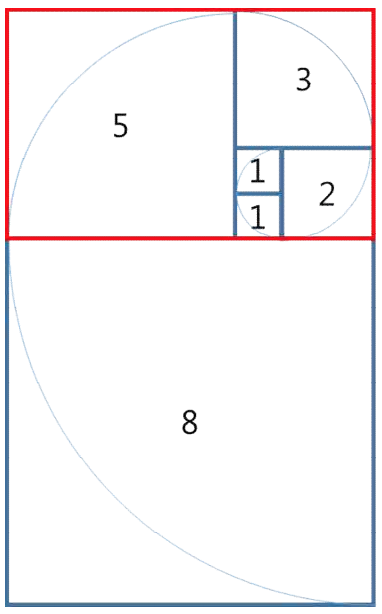

# 타일 장식물

### 문제 설명

대구 달성공원에 놀러 온 지수는 최근에 새로 만든 타일 장식물을 보게 되었다. 타일 장식물은 정사각형 타일을 붙여 만든 형태였는데, 한 변이 1인 정사각형 타일부터 시작하여 마치 앵무조개의 나선 모양처럼 점점 큰 타일을 붙인 형태였다. 타일 장식물의 일부를 그리면 다음과 같다.

> 1, 1, 2, 3, 5, 8, ...

지수는 문득 이러한 타일들로 구성되는 큰 직사각형의 둘레가 궁금해졌다. 예를 들어, 처음 다섯개의 타일이 구성하는 직사각형(위에서 빨간색으로 표시한 직사각형)의 둘레는 26이다.

타일의 개수 N(1 ≤ N ≤ 80)이 주어졌을 때, N개의 타일로 구성된 직사각형의 둘레를 구하는 프로그램을 작성하시오.

-----------
### 입력

표준 입력으로 다음 정보가 주어진다. 입력은 한 줄로 구성되며 이 줄에는 타일의 개수를 나타내는 정수 N(1 ≤ N ≤ 80)이 주어진다.

-----------
### 출력

표준 출력으로 N 개의 타일이 구성하는 타일 장식물 직사각형의 둘레를 출력한다.

64비트 정수형인 “long long” 자료형을 써야할 수 있음

-----------
### URL

https://www.acmicpc.net/problem/13301

-----------
## 풀이
1. 사각형이 추가될 때마다 둘레는 `새 사각형의 변의 길이*2` 만큼 커진다.
2. 따라서 dp를 이용해 `N`까지의 피보나치 수열을 구하며 둘레의 길이를 계산한다.
3. 구한 `N`번째 도형의 둘레의 길이를 출력한다.
4. 단, 피보나치 수열의 80번째 수가 `int` 자료형의 범위를 넘어가므로 `long` 자료형을 사용한다.