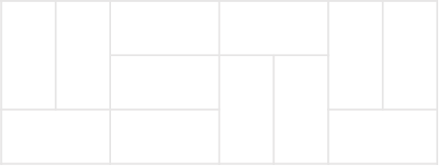

# 3 x n 타일링

### 문제 설명

가로 길이가 2이고 세로의 길이가 1인 직사각형 모양의 타일이 있습니다. 이 직사각형 타일을 이용하여 세로의 길이가 3이고 가로의 길이가 n인 바닥을 가득 채우려고 합니다. 타일을 채울 때는 다음과 같이 2가지 방법이 있습니다

- 타일을 가로로 배치 하는 경우
- 타일을 세로로 배치 하는 경우

예를들어서 n이 8인 직사각형은 다음과 같이 채울 수 있습니다.

직사각형의 가로의 길이 n이 매개변수로 주어질 때, 이 직사각형을 채우는 방법의 수를 return 하는 solution 함수를 완성해주세요.

-----------
### 제한 사항

- 가로의 길이 n은 5,000이하의 자연수 입니다.
- 경우의 수가 많아 질 수 있으므로, 경우의 수를 1,000,000,007으로 나눈 나머지를 return해주세요.

-----------
### 입출력 예

| n   | result |
|-----|--------|
| 4   | 11     |

-----------
### URL

https://programmers.co.kr/learn/courses/30/lessons/12902

-----------
## 풀이
1. 타일링 문제이기 때문에 DP를 사용하여 해결한다.
2. N이 홀수이면 타일을 채울 수 없으므로 짝수라고 가정한다.
3. `N=2`, `N=4`, `N=6`, `N=8`일 때를 가정하여 그려보고 점화식을 구하면 `f(n) = 3*f(n-2) + 2*f(n-4) + 2*f(n-6) + ... + 2*f(2) + 2`를 구할 수 있다.
4. 1000000006에 3을 곱하면 계산 도중 `int`타입의 범위를 넘어갈 수 있으므로 `long`타입을 사용한다.
5. `long`형 배열 `dp`를 생성하고 3번에 따라 채운다.
6. 배열의 크기를 줄이기 위해 인덱스를 모두 2로 나눠 사용한다.
7. `dp[n/2]`를 리턴한다.