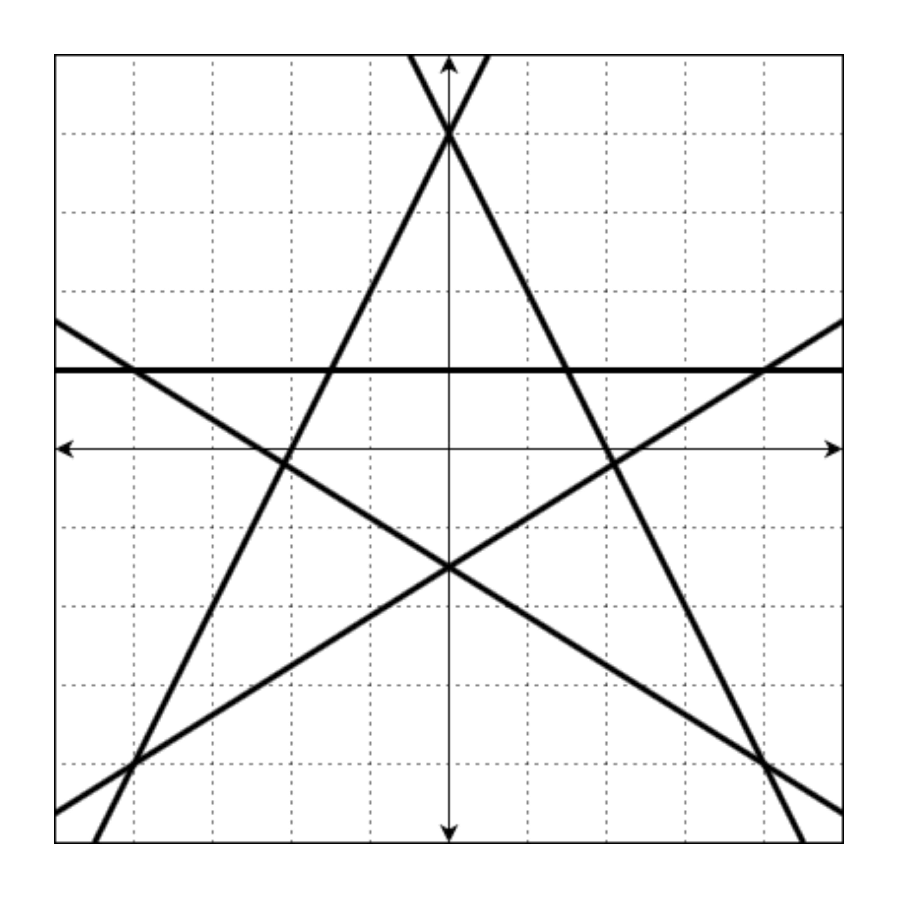
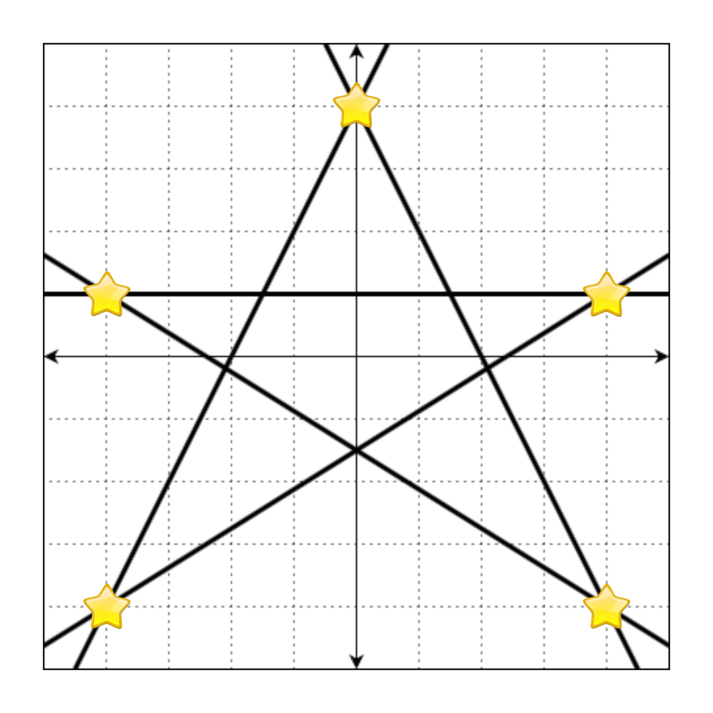

# 교점에 별 만들기

### 문제 설명

`Ax + By + C = 0`으로 표현할 수 있는 `n`개의 직선이 주어질 때, 이 직선의 교점 중 정수 좌표에 별을 그리려 합니다.

예를 들어, 다음과 같은 직선 5개를

- `2x - y + 4 = 0`
- `-2x - y + 4 = 0`
- `-y + 1 = 0`
- `5x - 8y - 12 = 0`
- `5x + 8y + 12 = 0`

좌표 평면 위에 그리면 아래 그림과 같습니다.



이때, 모든 교점의 좌표는 `(4, 1)`, `(4, -4)`, `(-4, -4)`, `(-4, 1)`, `(0, 4)`, `(1.5, 1.0)`, `(2.1, -0.19)`, `(0, -1.5)`, `(-2.1, -0.19)`, `(-1.5, 1.0)`입니다. 이 중 정수로만 표현되는 좌표는 `(4, 1)`, `(4, -4)`, `(-4, -4)`, `(-4, 1)`, `(0, 4)`입니다.

만약 정수로 표현되는 교점에 별을 그리면 다음과 같습니다.



위의 그림을 문자열로 나타낼 때, 별이 그려진 부분은 `*`, 빈 공간(격자선이 교차하는 지점)은 `.`으로 표현하면 다음과 같습니다.

```
"..........."  
".....*....."  
"..........."  
"..........."  
".*.......*."  
"..........."  
"..........."  
"..........."  
"..........."  
".*.......*."  
"..........."  
```

이때 격자판은 무한히 넓으니 모든 별을 포함하는 최소한의 크기만 나타내면 됩니다.

따라서 정답은

```
"....*...."  
"........."  
"........."  
"*.......*"  
"........."  
"........."  
"........."  
"........."  
"*.......*"  
```

입니다.

직선 `A, B, C`에 대한 정보가 담긴 배열 `line`이 매개변수로 주어집니다. 이때 모든 별을 포함하는 최소 사각형을 return 하도록 solution 함수를 완성해주세요.

-----------
### 제한 사항

- line의 세로(행) 길이는 2 이상 1,000 이하인 자연수입니다.
   - line의 가로(열) 길이는 3입니다.
   - line의 각 원소는 [A, B, C] 형태입니다.
   - A, B, C는 -100,000 이상 100,000 이하인 정수입니다.
   - 무수히 많은 교점이 생기는 직선 쌍은 주어지지 않습니다.
   - A = 0이면서 B = 0인 경우는 주어지지 않습니다.
- 정답은 1,000 * 1,000 크기 이내에서 표현됩니다.
- 별이 한 개 이상 그려지는 입력만 주어집니다.

-----------
### 입출력 예

| line                                                            | result                                                                                                                     |
|-----------------------------------------------------------------|----------------------------------------------------------------------------------------------------------------------------|
| [[2, -1, 4], [-2, -1, 4], [0, -1, 1], [5, -8, -12], [5, 8, 12]] | ["....\*....", ".........", ".........", "\*.......\*", ".........", ".........", ".........", ".........", "\*.......\*"] |
| [[0, 1, -1], [1, 0, -1], [1, 0, 1]]                             | ["\*.\*"]                                                                                                                  |
| [[1, -1, 0], [2, -1, 0]]                                        | ["*"]                                                                                                                      |
| [[1, -1, 0], [2, -1, 0], [4, -1, 0]]                            | ["*"]                                                                                                                      |

-----------
### URL

https://programmers.co.kr/learn/courses/30/lessons/87377

-----------
## 풀이
1. `a`, `b`, `c`의 최댓값은 `100,000`이고 이는 곱했을 시 `int`의 범위를 넘어가므로 `long`으로 선언한다.
2. 좌표를 표현할 `Point` 클래스를 정의한다.
3. 정수 좌표를 저장할 `Set`을 생성한다.
4. 최대 Y좌표`maxY`, 최대 X좌표`maxX`, 최소 Y좌표`minY`, 최소 X좌표`minX`를 기록할 변수를 생성한다.
5. `line`을 이중 반복문으로 순회하면서 원소 두 개를 뽑는다.
   1. 교점을 구하는 함수 `getIntersection()`를 호출한다.
      1. `getIntersection()`는 매개변수로 직선의 정보인 `int`형 배열 두 개를 받는다.
      2. 각 식의 계수를 `long`형 변수 a, b, c, d, e, f로 놓는다.
      3. 각 식을 교차하여 공식을 구하면 `x=(b*f-c*e)/(a*e-d*b)`, `y=(a*f-d*c)/(d*b-a*e)`이므로 그대로 계산한다.
      4. 계산 결과 두 직선이 평행하지 않고 각 좌표가 정수이면 `set`에 저장하고 `maxY`, `maxX`, `minY`, `minX`를 갱신한다.
6. 순회가 끝나면 `maxY-minY+1`로 `row길이`를, `maxX-minX+1`로 `col길이`를 구한다.
7. `String`형 배열`answer`의 원소를 모두 `.`으로 초기화한다.
8. `set`을 순회하면서 다음을 실행한다.
   1. `row`의 좌표는 `maxY`에서 현재 원소의 `y`값을 뺀 값이 되고, `col`의 좌표는 현재 원소의 `x`값에서 `minX`를 뺀 값이 된다. 
   2. 구한 `row`, `col`에 해당하는 `answer`의 값을 `*`로 변경한다.
9. `answer`를 리턴한다.