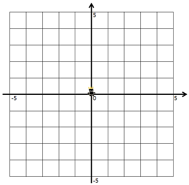
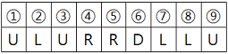
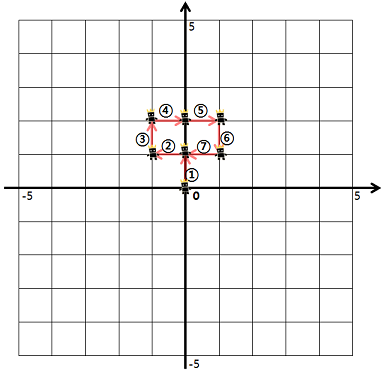
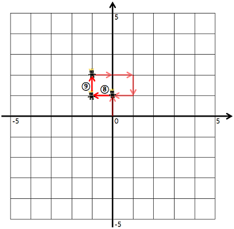
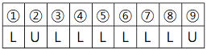
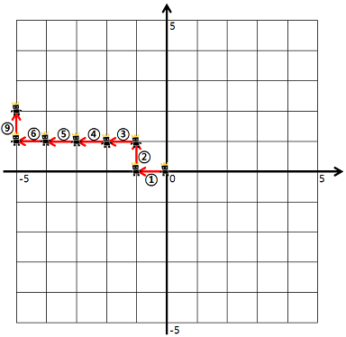

# 방문 길이

### 문제 설명

게임 캐릭터를 4가지 명령어를 통해 움직이려 합니다. 명령어는 다음과 같습니다.

- U: 위쪽으로 한 칸 가기
- D: 아래쪽으로 한 칸 가기
- R: 오른쪽으로 한 칸 가기
- L: 왼쪽으로 한 칸 가기

캐릭터는 좌표평면의 (0, 0) 위치에서 시작합니다. 좌표평면의 경계는 왼쪽 위(-5, 5), 왼쪽 아래(-5, -5), 오른쪽 위(5, 5), 오른쪽 아래(5, -5)로 이루어져 있습니다.

예를 들어, "ULURRDLLU"로 명령했다면

- 1번 명령어부터 7번 명령어까지 다음과 같이 움직입니다.

- 8번 명령어부터 9번 명령어까지 다음과 같이 움직입니다.

이때, 우리는 게임 캐릭터가 지나간 길 중 캐릭터가 처음 걸어본 길의 길이를 구하려고 합니다. 예를 들어 위의 예시에서 게임 캐릭터가 움직인 길이는 9이지만, 캐릭터가 처음 걸어본 길의 길이는 7이 됩니다. (8, 9번 명령어에서 움직인 길은 2, 3번 명령어에서 이미 거쳐 간 길입니다)

단, 좌표평면의 경계를 넘어가는 명령어는 무시합니다.

예를 들어, "LULLLLLLU"로 명령했다면

1번 명령어부터 6번 명령어대로 움직인 후, 7, 8번 명령어는 무시합니다. 다시 9번 명령어대로 움직입니다.

이때 캐릭터가 처음 걸어본 길의 길이는 7이 됩니다.

명령어가 매개변수 dirs로 주어질 때, 게임 캐릭터가 처음 걸어본 길의 길이를 구하여 return 하는 solution 함수를 완성해 주세요.

-----------
### 제한 사항

- dirs는 string형으로 주어지며, 'U', 'D', 'R', 'L' 이외에 문자는 주어지지 않습니다.
- dirs의 길이는 500 이하의 자연수입니다.

-----------
### 입출력 예

| dirs        | result |
|-------------|--------|
| "ULURRDLLU" | 7      |
| "LULLLLLLU" | 7      |

-----------
### URL

https://programmers.co.kr/learn/courses/30/lessons/49994

-----------
## 풀이
1. 11, 10의 크기를 가지는 boolean타입의 이차원 배열`visitedRow`를 생성한다.
2. 10, 11의 크기를 가지는 boolean타입의 이차원 배열`visitedCol`을 생성한다.
3. `answer`를 0으로 초기화한다.
4. `dirs`를 순회하면서 다음을 수행한다.
   1. 방향에 따라 이동할 수 있는지 확인하고 이동할 수 있으면 이동한다.
   2. 이동 불가능하면 다음 문자로 넘어간다.
   3. 움직인 길이 `row`인지 `col`인지 판단하고 처음이면 알맞는 `visitedXXX`에 체크하고 `answer`에 1을 더한다.
5. 순회가 끝나면 `answer`를 리턴한다.