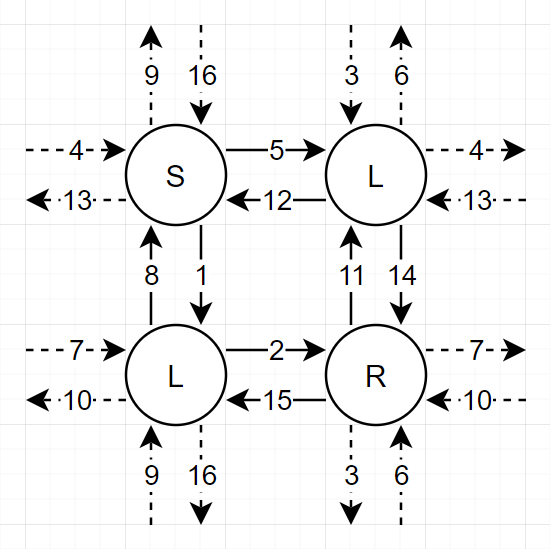

# 빛의 경로 사이클

### 문제 설명

각 칸마다 S, L, 또는 R가 써져 있는 격자가 있습니다. 당신은 이 격자에서 빛을 쏘고자 합니다. 이 격자의 각 칸에는 다음과 같은 특이한 성질이 있습니다.

- 빛이 "S"가 써진 칸에 도달한 경우, 직진합니다.
- 빛이 "L"이 써진 칸에 도달한 경우, 좌회전을 합니다.
- 빛이 "R"이 써진 칸에 도달한 경우, 우회전을 합니다.
- 빛이 격자의 끝을 넘어갈 경우, 반대쪽 끝으로 다시 돌아옵니다. 예를 들어, 빛이 1행에서 행이 줄어드는 방향으로 이동할 경우, 같은 열의 반대쪽 끝 행으로 다시 돌아옵니다.

당신은 이 격자 내에서 빛이 이동할 수 있는 경로 사이클이 몇 개 있고, 각 사이클의 길이가 얼마인지 알고 싶습니다. 경로 사이클이란, 빛이 이동하는 순환 경로를 의미합니다.

예를 들어, 다음 그림은 격자 `["SL","LR"]`에서 1행 1열에서 2행 1열 방향으로 빛을 쏠 경우, 해당 빛이 이동하는 경로 사이클을 표현한 것입니다.

이 격자에는 길이가 16인 사이클 1개가 있으며, 다른 사이클은 존재하지 않습니다.

격자의 정보를 나타내는 1차원 문자열 배열 `grid`가 매개변수로 주어집니다. 주어진 격자를 통해 만들어지는 빛의 경로 사이클의 모든 길이들을 배열에 담아 오름차순으로 정렬하여 return 하도록 solution 함수를 완성해주세요.

-----------
### 제한 사항

- 1 ≤ `grid`의 길이 ≤ 500
  - 1 ≤ `grid`의 각 문자열의 길이 ≤ 500
  - `grid`의 모든 문자열의 길이는 서로 같습니다.
  - `grid`의 모든 문자열은 'L', 'R', 'S'로 이루어져 있습니다.

-----------
### 입출력 예

| grid         | result       |
|--------------|--------------|
| ["SL", "LR"] | [16]         |
| ["S"]        | [1, 1, 1, 1] |
| ["R", "R"]   | [4, 4]       |

-----------
### URL

https://programmers.co.kr/learn/courses/30/lessons/86052

-----------
## 풀이
1. `boolean[grid.length][grid[0].length()][4]` 타입의 `visited`를 생성한다.
2. `grid`를 순회하며 `visited`를 채운다.
3. 모든 노드에서 모든 방향으로 한 번씩 나가면 더이상 사이클이 없으므로 각 방향을 검사하여 나가지 않은 방향이 있다면 `progress()`를 수행한다.
   1. `progress()`는 매개변수로 `row`, `col`, `dir`을 받는다.
   2. 사이클의 크기를 측정할 `cnt`를 0으로 초기화한다.
   3. `row`행 `col`열에서 `dir`방향으로 이동했으므로 방문 처리한다.
   4. `cnt`를 1 증가시킨다.
   5. `row`, `col`, `dir`을 갱신한다.
   6. 진행 방향이 이미 방문한 방향일 때까지 3~5를 반복한다.
   7. 사이클 측정이 종료되면 `List<Integer> answer`에 `cnt`를 추가한다.
4. 모든 노드의 모든 방향에 대해 방문 체크가 완료되면 `answer`를 리턴한다.