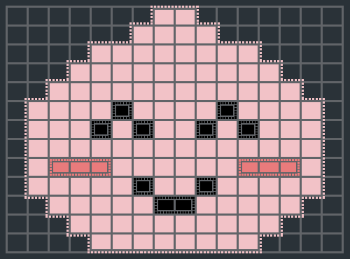

# 카카오 프렌즈 컬러링북

### 문제 설명

출판사의 편집자인 어피치는 네오에게 컬러링북에 들어갈 원화를 그려달라고 부탁하여 여러 장의 그림을 받았다. 여러 장의 그림을 난이도 순으로 컬러링북에 넣고 싶었던 어피치는 영역이 많으면 색칠하기가 까다로워 어려워진다는 사실을 발견하고 그림의 난이도를 영역의 수로 정의하였다. (영역이란 상하좌우로 연결된 같은 색상의 공간을 의미한다.)

그림에 몇 개의 영역이 있는지와 가장 큰 영역의 넓이는 얼마인지 계산하는 프로그램을 작성해보자.

위의 그림은 총 12개 영역으로 이루어져 있으며, 가장 넓은 영역은 어피치의 얼굴면으로 넓이는 120이다.
그림에 몇 개의 영역이 있는지와 가장 큰 영역은 몇 칸으로 이루어져 있는지를 원소가 두 개인 정수 배열로 리턴해라.
-----------
### 제한 사항

- 입력은 그림의 크기를 나타내는 `m`과 `n`, 그리고 그림을 나타내는 `m × n` 크기의 2차원 배열 `picture`로 주어진다. 제한조건은 아래와 같다.
  - `1 <= m, n <= 100`
  - `picture`의 원소는 `0` 이상 `2^31 - 1` 이하의 임의의 값이다.
  - `picture`의 원소 중 값이 `0`인 경우는 색칠하지 않는 영역을 뜻한다.

-----------
### 입출력 예

| m   | n   | picture                                                                              | result |
|-----|-----|--------------------------------------------------------------------------------------|--------|
| 6   | 4   | [[1, 1, 1, 0], [1, 2, 2, 0], [1, 0, 0, 1], [0, 0, 0, 1], [0, 0, 0, 3], [0, 0, 0, 3]] | [4, 5] |

-----------
### URL

https://programmers.co.kr/learn/courses/30/lessons/1829

-----------
## 풀이
1. numberOfArea와 maxSizeOfOneArea를 0으로 초기화한다.
2. visited[m][n]을 생성한다.
3. 배열을 순회하면서 방문하지 않았다면 bfs를 진행한다.
   1. 구역이 생기므로 numberOfArea에 1을 더한다.
   2. visited, picture, 현재 행, 열 값을 인수로 넘긴다.
   3. 행 값과 열 값을 저장할 큐를 생성하고 현재 행, 열 값을 삽입한 뒤 방문체크한다.
   4. 행과 열 값을 이용해 찾을 색깔 color를 저장하고 size를 0으로 초기화한다.
   5. 큐에서 poll하여 사방으로 뻗을 수 있는지 검사한다.
   6. 뻗을 수 있고, color가 같으며 방문하지 않았다면 방문체크하고 size를 1더한 뒤 큐에 삽입힌다.
   7. 5~6번을 큐가 빌 때까지 반복한 후 size를 리턴한다.
4. bfs가 끝나면 리턴된 size와 maxSizeOfOneArea를 비교하여 큰 값을 저장한다.
5. 모든 원소에 대해 3~4번이 끝나면 numberOfArea와 maxSizeOfOneArea를 배열로 만들어 리턴한다.