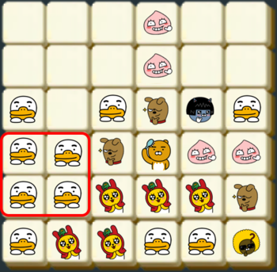

# 프렌즈4블록

### 문제 설명

블라인드 공채를 통과한 신입 사원 라이언은 신규 게임 개발 업무를 맡게 되었다. 이번에 출시할 게임 제목은 "프렌즈4블록".
같은 모양의 카카오프렌즈 블록이 2×2 형태로 4개가 붙어있을 경우 사라지면서 점수를 얻는 게임이다.


만약 판이 위와 같이 주어질 경우, 라이언이 2×2로 배치된 7개 블록과 콘이 2×2로 배치된 4개 블록이 지워진다. 같은 블록은 여러 2×2에 포함될 수 있으며, 지워지는 조건에 만족하는 2×2 모양이 여러 개 있다면 한꺼번에 지워진다.


블록이 지워진 후에 위에 있는 블록이 아래로 떨어져 빈 공간을 채우게 된다.



만약 빈 공간을 채운 후에 다시 2×2 형태로 같은 모양의 블록이 모이면 다시 지워지고 떨어지고를 반복하게 된다.


위 초기 배치를 문자로 표시하면 아래와 같다.

```
TTTANT
RRFACC
RRRFCC
TRRRAA
TTMMMF
TMMTTJ
```

각 문자는 라이언(R), 무지(M), 어피치(A), 프로도(F), 네오(N), 튜브(T), 제이지(J), 콘(C)을 의미한다

입력으로 블록의 첫 배치가 주어졌을 때, 지워지는 블록은 모두 몇 개인지 판단하는 프로그램을 제작하라.

-----------
### 입력 형식

- 입력으로 판의 높이 `m`, 폭 `n`과 판의 배치 정보 `board`가 들어온다.
- 2 <= `n`, `m` <= 30
- `board`는 길이 `n`인 문자열 `m`개의 배열로 주어진다. 블록을 나타내는 문자는 A에서 Z가 사용된다.

-----------
### 출력 형식

입력으로 주어진 판 정보를 가지고 몇 개의 블록이 지워질지 출력하라.

-----------
### 입출력 예

| m   | n   | board                                                        | result |
|-----|-----|--------------------------------------------------------------|--------|
| 4   | 5   | ["CCBDE", "AAADE", "AAABF", "CCBBF"]                         | 14     |
| 6   | 6   | ["TTTANT", "RRFACC", "RRRFCC", "TRRRAA", "TTMMMF", "TMMTTJ"] | 15     |

-----------
### URL

https://programmers.co.kr/learn/courses/30/lessons/12900

-----------
## 풀이
1. board를 이용해 char형 2차원 배열 map을 생성한다.
2. 블록을 터트리는 함수 pop()을 정의한다.
   1. pop()은 매개변수로 map을 받는다.
   2. map의 크기에 맞춰 visited를 생성한다.
   3. 모든 원소를 순회하며 visited하지 않았고, ^(빈칸)이 아닌 원소에 대해 checkNearby()를 실행한다.
      1. checkNearby()는 매개변수로 map, visited, col, row를 받는다.
      2. (col, row)를 큐에 넣고 bfs를 실행한다.
      3. 큐에서 꺼내서 확정된 좌표 모음인 ArrayList에 저장한다.
      4. (col+1, row), (col, row+1), (col+1, row+1)이 모두 같은 문자이면 큐에 넣고 방문체크한다.
      5. bfs가 끝나면 ArrayList의 크기를 세고 4이상이면 해당 좌표들의 값을 모두 ^으로 변경한다.
      6. ArrayList의 크기를 리턴한다.
   4. 리턴된 크기만큼 변경된 것이므로 cnt에 누적한다.
   5. 모든 원소에 대해 실행했으면 cnt를 리턴한다.
3. 블록을 아래로 당기는 함수 pull()을 정의한다.
   1. pull()은 매개변수로 map을 받는다.
   2. 열단위로 마지막 행부터 ^(빈칸)을 체크하고 빈칸이라면 그 위의 원소를 아래로 내린다.
   3. 모든 열에 대해 2번을 수행한다.
4. pop()을 실행하고 사라진 블록의 개수가 0이 아니면 pull()을 실행하고 사라진 블록의 개수를 answer에 더한다.
5. 사라진 블록이 없을 때까지 3번을 반복한다.
6. answer를 리턴한다.