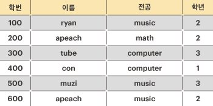

# 후보키

### 문제 설명

프렌즈대학교 컴퓨터공학과 조교인 제이지는 네오 학과장님의 지시로, 학생들의 인적사항을 정리하는 업무를 담당하게 되었다.

그의 학부 시절 프로그래밍 경험을 되살려, 모든 인적사항을 데이터베이스에 넣기로 하였고, 이를 위해 정리를 하던 중에 후보키(Candidate Key)에 대한 고민이 필요하게 되었다.

후보키에 대한 내용이 잘 기억나지 않던 제이지는, 정확한 내용을 파악하기 위해 데이터베이스 관련 서적을 확인하여 아래와 같은 내용을 확인하였다.

- 관계 데이터베이스에서 릴레이션(Relation)의 튜플(Tuple)을 유일하게 식별할 수 있는 속성(Attribute) 또는 속성의 집합 중, 다음 두 성질을 만족하는 것을 후보 키(Candidate Key)라고 한다.
  - 유일성(uniqueness) : 릴레이션에 있는 모든 튜플에 대해 유일하게 식별되어야 한다.
  - 최소성(minimality) : 유일성을 가진 키를 구성하는 속성(Attribute) 중 하나라도 제외하는 경우 유일성이 깨지는 것을 의미한다. 즉, 릴레이션의 모든 튜플을 유일하게 식별하는 데 꼭 필요한 속성들로만 구성되어야 한다.

제이지를 위해, 아래와 같은 학생들의 인적사항이 주어졌을 때, 후보 키의 최대 개수를 구하라.

위의 예를 설명하면, 학생의 인적사항 릴레이션에서 모든 학생은 각자 유일한 "학번"을 가지고 있다. 따라서 "학번"은 릴레이션의 후보 키가 될 수 있다.
그다음 "이름"에 대해서는 같은 이름("apeach")을 사용하는 학생이 있기 때문에, "이름"은 후보 키가 될 수 없다. 그러나, 만약 ["이름", "전공"]을 함께 사용한다면 릴레이션의 모든 튜플을 유일하게 식별 가능하므로 후보 키가 될 수 있게 된다.
물론 ["이름", "전공", "학년"]을 함께 사용해도 릴레이션의 모든 튜플을 유일하게 식별할 수 있지만, 최소성을 만족하지 못하기 때문에 후보 키가 될 수 없다.
따라서, 위의 학생 인적사항의 후보키는 "학번", ["이름", "전공"] 두 개가 된다.

릴레이션을 나타내는 문자열 배열 relation이 매개변수로 주어질 때, 이 릴레이션에서 후보 키의 개수를 return 하도록 solution 함수를 완성하라.

-----------
### 제한 사항

- relation은 2차원 문자열 배열이다.
- relation의 컬럼(column)의 길이는 `1` 이상 `8` 이하이며, 각각의 컬럼은 릴레이션의 속성을 나타낸다.
- relation의 로우(row)의 길이는 `1` 이상 `20` 이하이며, 각각의 로우는 릴레이션의 튜플을 나타낸다.
- relation의 모든 문자열의 길이는 `1` 이상 `8` 이하이며, 알파벳 소문자와 숫자로만 이루어져 있다.
- relation의 모든 튜플은 유일하게 식별 가능하다.(즉, 중복되는 튜플은 없다.)

-----------
### 입출력 예

| relation                                                                                                                                                                    | result |
|-----------------------------------------------------------------------------------------------------------------------------------------------------------------------------|--------|
| [["100","ryan","music","2"],["200","apeach","math","2"],["300","tube","computer","3"],["400","con","computer","4"],["500","muzi","music","3"],["600","apeach","music","2"]] | 2      |

-----------
### URL

https://programmers.co.kr/learn/courses/30/lessons/42890

-----------
## 풀이
1. `row`의 길이를 `rowLen`으로, `col`의 길이를 `colLen`으로 정의한다.
2. 등장했던 후보키를 저장할 `Set<Integer>`타입의 `candidateKey`를 생성한다.
3. 조합을 구성하는 것을 비트마스크로 구현한다.
   1. 2진수의 각 자리가 `0`이면 선택이 된 것이고, `1`이면 선택이 안 된 것으로 정의한다.
   2. `1`을 `colLen`만큼 왼쪽 시프트 연산하면 1의 조건을 이용할 수 있는 수+1이 나온다.
   3. 1~2번을 이용하여 인덱스를 이용한 반복문으로 조합을 구성한다.
4. `isMin()`을 정의하여 3번에서 구성한 조합의 최소성을 확인한다.
   1. `isMin()`은 매개변수로 `set`, `candidateKey`를 받는다.
   2. `candidateKey`를 순회하면서 `set`과의 `&연산` 결과가 자기 자신이 되는지 확인한다.
   3. 2번의 조건을 만족하면 `set`의 부분집합이 이전에 등장했었다는 것을 의미하므로 `false`를 리턴한다.
   4. 모든 `key`가 2번의 조건을 피했다면 이전에 등장하지 않았다는 것이므로 `true`를 리턴한다.
5. `isUni()`를 정의하여 3번에서 구성한 조합의 유일성을 확인한다.
   1. `isUni()`는 매개변수로 `set`, `rowLen`, `colLen`, `relation`을 받는다.
   2. 이전에 등장했던 문자열을 기록하기 위한 `Set<Integer>`타입의 `appeared`를 생성한다.
   3. `row`와 `col`을 각각 0부터 `rowLen`, `colLen`까지 순회한다.
   4. 유일성을 확인하기 위해 각 `row`마다 `set`에 해당되는 `col`의 문자열을 합쳐 저장해야하므로 `StringBuilder`를 생성한다.
   5. 1을 `col`만큼 왼쪽 시프트 연산하고 `&연산`하여 해당 `col`이 조합에 포함되었는지 검사하고 포함되었다면 중복을 방지하기 위해 `&`을 추가하여 `StringBuilder`에 문자열을 붙인다.
   6. `col`순회가 끝나고 문자열이 완성되었으면 `string`으로 변환한다.
   7. 변환한 `string`이 `appeared`에 존재한다면 유일성이 성립하지 않으므로 `false`를 리턴한다.
   8. 변환한 `string`이 `appeared`에 존재하지 않는다면 `appeared`에 저장하고 다음 `row`에 대해 유일성 검사를 진행한다.
   9. 모든 `row`가 7번의 조건을 피했다면 유일성이 성립하는 것이므로 `true`를 리턴한다.
6. `isMin()`과 `isUni()`가 모두 `true`이면 후보키이므로 구성한 `set`을 `candidateKey`에 저장한다.
7. 모든 조합에 대해 후보키 여부를 따졌다면 `candidateKey`의 크기를 리턴한다.