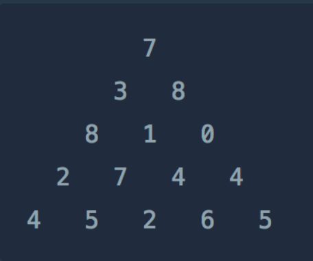

# 정수 삼각형

### 문제 설명

위와 같은 삼각형의 꼭대기에서 바닥까지 이어지는 경로 중, 거쳐간 숫자의 합이 가장 큰 경우를 찾아보려고 합니다. 아래 칸으로 이동할 때는 대각선 방향으로 한 칸 오른쪽 또는 왼쪽으로만 이동 가능합니다. 예를 들어 3에서는 그 아래칸의 8 또는 1로만 이동이 가능합니다.

삼각형의 정보가 담긴 배열 triangle이 매개변수로 주어질 때, 거쳐간 숫자의 최댓값을 return 하도록 solution 함수를 완성하세요.

-----------
### 제한 사항

- 삼각형의 높이는 1 이상 500 이하 입니다.
- 삼각형을 이루고 있는 숫자는 0 이상 9,999 이하의 정수입니다.

-----------
### 입출력 예

| triangle | result |
|----------|--------|
|   [[7], [3, 8], [8, 1, 0], [2, 7, 4, 4], [4, 5, 2, 6, 5]]   | 30     |

-----------
### URL

https://programmers.co.kr/learn/courses/30/lessons/43105

-----------
## 풀이
1. 피라미드의 깊이를 n, 열 인덱스를 i라 할 때, n행 i열의 최대값은 n-1행의 i-1열의 최대값과 i열의 최대값 중 큰 값 + 자기 자신의 수가 된다.
2. 또한 각 행의 피라미드 양 끝은 각각 이전 행의 열 인덱스 0과 마지막 값만을 계승한다.
3. 1과 2의 조건을 이용하여 DP로 각 노드의 최대값을 계산한다.
4. 3번이 끝났으면 마지막 행의 노드를 탐색하여 최대값을 리턴한다.